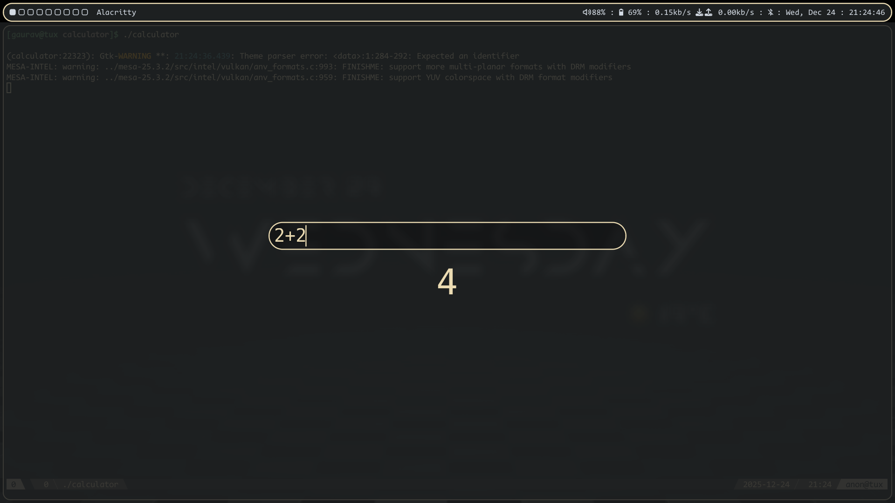

# calculator

A minimal calculator application that displays a fullscreen overlay with a centered text input. As you type, the input is piped to `bc` and results are displayed below the input.



## Requirements

- GTK4
- gtk4-layer-shell (development headers)
- GCC (or compatible C compiler)
- pkg-config
- `bc` command-line calculator

## Building

Clone the repository and run:

```sh
make
```

To install the binary to `/usr/local/bin/` (requires appropriate permissions):

```sh
sudo make install
```

To clean up build artifacts:

```sh
make clean
```

